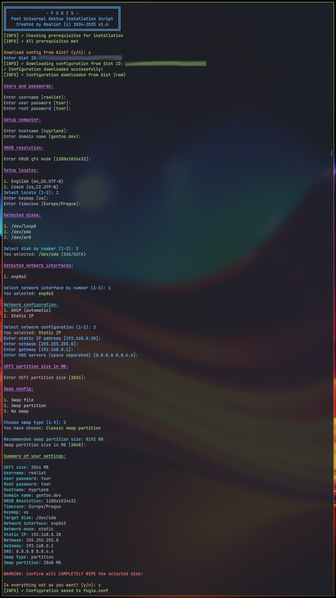
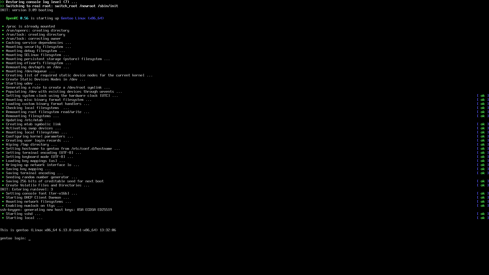

# FUGIS
---
### Fast Universal Gentoo Installation Script

 is a debugged bash script that quickly install basic clear Gentoo Linux on your harddrive.

Certainly! Here are the positives of your script in Markdown format and in English:

### Positives of the Script

- **Interactive Setup:**
  Guides the user step-by-step through all key installation choices (disk, user, network, kernel, locale, etc.), making it very beginner-friendly.

- **Input Validation:**
  Validates user inputs (IP, hostname, username, partition sizes, etc.), reducing the risk of errors during installation.

- **Clear and Colored Output:**
  Uses colors and formatting for outputs, making the process easy to follow and visually organized.

- **Automates Routine Operations:**
  Handles partitioning, filesystem creation, Stage3 downloading, network and locale setup, and more, minimizing manual intervention.

- **Comprehensive Configuration:**
  Sets up kernel sources, users, sudo privileges, GRUB bootloader, and essential services—all in one script.

- **Logging:**
  Logs all installation actions into a file for troubleshooting and review.

- **Safety Warnings:**
  Clearly warns the user before performing destructive operations, such as wiping the target disk.

- **Hardware Detection:**
  Detects CPU and GPU types to optimize configuration and USE flags.

- **Supports Both DHCP and Static Network:**
  Allows the user to choose between DHCP and static network setups, with proper validation.

- **Swap Recommendation:**
  Calculates and recommends swap partition size based on system RAM.

### How to use this script ?
- download minimal installation CD from [gentoo.org](https://distfiles.gentoo.org/releases/amd64/autobuilds/current-install-amd64-minimal/)
- create bootable USB stick

#### 1. Download and run script
- download [script](https://raw.githubusercontent.com/lotrando/fugis-gentoo-installer/refs/heads/main/installer.sh) from GitHub
- save script to bootable USB stick
- make script executable
```
chmod +x installer.sh
```
- boot from USB stick and run from USB
```
  ./installer.sh
```


#### 2. Run downloaded script direct from shell
- boot from USB stick
- in command line run two command lines
 ```
wget https://raw.githubusercontent.com/lotrando/fugis-gentoo-installer/refs/heads/main/installer.sh
```
```
chmod +x installer.sh && ./installer.sh
```

### Installation procedure


- setup script variables and run installer
- it will take some time to compile the kernel and packages
- reboot and use new clear Gentoo linux



### Script install only contain 26 important packages and kernel if used zen kernel sources

#### Kernel Build part
```
(01) dev-libs/elfutils
(02) virtual/libelf
(03) app-arch/cpio
(04) app-alternatives/cpio
(05) sys-kernel/zen-sources
(06) sys-kernel/linux-firmware
(07) app-text/asciidoc
(08) sys-kernel/genkernel
```
#### Packages Install part
```
(09) sys-fs/dosfstools
(10) sys-fs/f2fs-tools
(11) sys-apps/hwdata
(12) virtual/libudev
(13) x11-base/xorg-proto
(14) media-libs/libpng
(15) app-text/mandoc
(16) sys-fs/fuse-common
(17) sys-fs/lvm2
(18) sys-apps/pciutils
(19) x11-apps/bdftopcf
(20) media-libs/freetype
(21) sys-libs/efivar
(22) sys-fs/fuse
(23) sys-boot/efibootmgr
(24) media-fonts/terminus-font
(25) sys-boot/grub
(26) app-admin/sudo
```

### Installation steps
```
[INFO] ✓ Starting installation process...
[INFO] ✓ Starting disk setup
[INFO] ✓ Creating partitions on /dev/sda
[INFO] ✓ Creating swap partition
[INFO] ✓ Creating filesystems
[INFO] ✓ Mounting filesystems
[INFO] ✓ Downloading latest stage3 tarball
[INFO] ✓ Downloading: stage3-amd64-openrc-xxxxxxxxxxxxx.tar.xz
[INFO] ✓ Extracting stage3: stage3-amd64-openrc-xxxxxxxxxxxxx.tar.xz
[INFO] ✓ Cleaning up downloaded tarball
[INFO] ✓ Mounting [proc sys dev run] filesystems
[INFO] ✓ Detected AMD GPU
[INFO] ✓ Detect CPU flags: aes avx avx2 bmi1 bmi2 f16c fma3 mmx mmxext pclmul popcnt rdrand sse sse2 sse3 sse4_1 sse4_2 ssse3
[INFO] ✓ Detect MAKEOPTS: -j6
[INFO] ✓ Creating configuration for chroot
[INFO] ✓ Creating chroot installation script
[INFO] ✓ Entering chroot and starting installation
[INFO] ✓ Installation completed successfully!
[INFO] ✓ Cleaning up...
```
### Screen after installation


