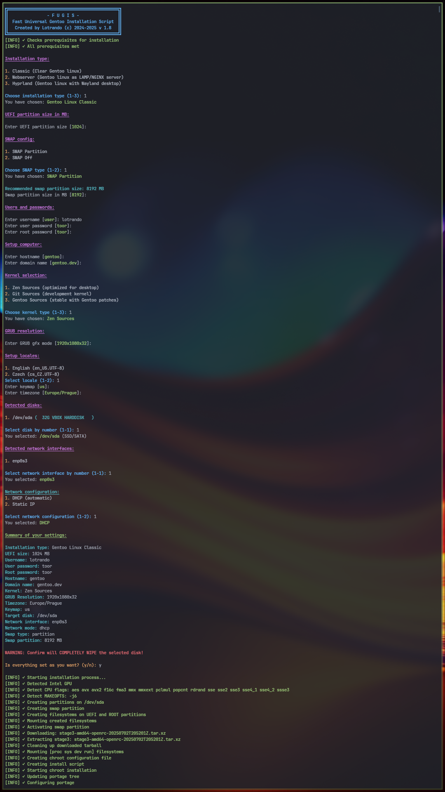

# FUGIS
---
### Fast Universal Gentoo Installation Script

 is a tweaked bash script that quickly install a basic and clean Gentoo Linux onto your hard drive. **installer.sh** is pure Gentoo Linux. And the other scripts is modified and install additional packages. Script **webserver.sh** instal classic web server latest php apache mysql server and phpmyadmin. Script **hyprland.sh** install packages where after do tty login automaticaly run Hyprland desktop.

 ---

### Positives of the Script

- **Interactive Setup:**
  Guides the user step-by-step through all key installation choices (disk, user, network, kernel, locale, etc.), making it very beginner-friendly.

- **Input Validation:**
  Validates user inputs (IP, hostname, username, partition sizes, etc.), reducing the risk of errors during installation.

- **Clear and Colored Output:**
  Uses colors and formatting for outputs, making the process easy to follow and visually organized.

- **Automates Routine Operations:**
  Handles partitioning, filesystem creation, Stage3 downloading, network and locale setup, and more, minimizing manual intervention.

- **Comprehensive Configuration:**
  Sets up kernel sources, users, sudo privileges, GRUB bootloader, and essential services—all in one script.

- **Logging:**
  Logs all installation actions into a file for troubleshooting and review.

- **Safety Warnings:**
  Clearly warns the user before performing destructive operations, such as wiping the target disk.

- **Hardware Detection:**
  Detects CPU and GPU types to optimize configuration and USE flags.

- **Supports Both DHCP and Static Network:**
  Allows the user to choose between DHCP and static network setups, with proper validation.

- **Swap Recommendation:**
  Calculates and recommends swap partition size based on system RAM.

### How to use this script ?
- download minimal installation CD from [gentoo.org](https://distfiles.gentoo.org/releases/amd64/autobuilds/current-install-amd64-minimal/)
- create bootable USB stick

#### 1. Download and run script
- download [script](https://raw.githubusercontent.com/lotrando/fugis-gentoo-installer/refs/heads/main/installer.sh) from GitHub
- save script to bootable USB stick
- make script executable
```
chmod +x installer.sh
```
- boot from USB stick and run from USB
```
  ./installer.sh
```


#### 2. Run downloaded script direct from shell
- boot from USB stick
- in command line run two command lines one with chosen script

1. Vanilla
 ```
wget https://raw.githubusercontent.com/lotrando/fugis-gentoo-installer/refs/heads/main/vanilla.sh
```

2. Classic
 ```
wget https://raw.githubusercontent.com/lotrando/fugis-gentoo-installer/refs/heads/main/installer.sh
```
3. Webserver
 ```
wget https://raw.githubusercontent.com/lotrando/fugis-gentoo-installer/refs/heads/main/webserver.sh
```
4. Hyprland Desktop
 ```
wget https://raw.githubusercontent.com/lotrando/fugis-gentoo-installer/refs/heads/main/hyprland.sh
```
```
chmod +x script_name && ./script_name
```

### Installation procedure


- setup script variables and run installer
- it will take some time to compile the kernel and packages
- reboot and use new clear Gentoo linux



### Script install only contain 26 important packages and kernel if used zen kernel sources

#### Kernel Build part
```
(01) dev-libs/elfutils
(02) virtual/libelf
(03) app-arch/cpio
(04) app-alternatives/cpio
(05) sys-kernel/zen-sources
(06) sys-kernel/linux-firmware
(07) app-text/asciidoc
(08) sys-kernel/genkernel
```
#### Packages Install part
```
(09) sys-fs/dosfstools
(10) sys-fs/f2fs-tools
(11) sys-apps/hwdata
(12) virtual/libudev
(13) x11-base/xorg-proto
(14) media-libs/libpng
(15) app-text/mandoc
(16) sys-fs/fuse-common
(17) sys-fs/lvm2
(18) sys-apps/pciutils
(19) x11-apps/bdftopcf
(20) media-libs/freetype
(21) sys-libs/efivar
(22) sys-fs/fuse
(23) sys-boot/efibootmgr
(24) media-fonts/terminus-font
(25) sys-boot/grub
(26) app-admin/sudo
```
WEB SERVER
```
(27) app-admin/apache-tools
(28) app-admin/metalog
(29) app-admin/webapp-config
(30) app-arch/libarchive
(31) app-arch/lz4
(32) app-crypt/rhash
(33) app-dicts/aspell-cs
(34) app-eselect/eselect-php
(35) app-text/aspell
(36) app-text/xmlto
(37) dev-build/cmake
(38) dev-db/mysql
(39) dev-db/mysql-connector-c
(40) dev-db/mysql-init-scripts
(41) dev-db/phpmyadmin
(42) dev-lang/nasm
(43) dev-lang/php
(44) dev-libs/apr
(45) dev-libs/apr-util
(46) dev-libs/icu
(47) dev-libs/jsoncpp
(48) dev-libs/libaio
(49) dev-libs/libevent
(50) dev-libs/libuv
(51) dev-libs/libzip
(52) mail-mta/nullmailer
(53) media-libs/gd
(54) media-libs/libjpeg-turbo
(55) net-dns/c-ares
(56) net-libs/nghttp2
(57) net-libs/libpsl
(58) net-libs/rpcsvc-proto
(59) net-misc/curl
```


### Installation steps
```
[INFO] ✓ Starting installation process...
[INFO] ✓ Starting partitions setup
[INFO] ✓ Creating partitions on /dev/sda
[INFO] ✓ Creating filesystems on UEFI and ROOT partitions
[INFO] ✓ Mounting created filesystems
[INFO] ✓ Downloading: stage3-amd64-openrc-20250629T163708Z.tar.xz
[INFO] ✓ Extracting stage3: stage3-amd64-openrc-20250629T163708Z.tar.xz
[INFO] ✓ Cleaning up downloaded tarball
[INFO] ✓ Mounting [proc sys dev run] filesystems
[INFO] ✓ Detected Intel GPU
[INFO] ✓ Detect CPU flags: aes avx avx2 bmi1 bmi2 f16c fma3 mmx mmxext pclmul popcnt rdrand sse sse2 sse3 sse4_1 sse4_2 ssse3
[INFO] ✓ Detect MAKEOPTS: -j6
[INFO] ✓ Creating configuration for chroot
[INFO] ✓ Creating chroot installation script
[INFO] ✓ Entering chroot and starting installation
[INFO] ✓ Starting chroot installation
[INFO] ✓ Updating portage tree
[INFO] ✓ Configuring portage
[INFO] ✓ Configuring GPU in make.conf
[INFO] ✓ Configuring CPU FLAGS in make.conf
[INFO] ✓ Configuring MAKEOPTS in make.conf
[INFO] ✓ Make /etc/fstab
[INFO] ✓ Configuring [hostname, consolefont, hosts]
[INFO] ✓ Configuring LAN
[INFO] ✓ Configuring keymap
[INFO] ✓ Configuring locales
[INFO] ✓ Setting timezone
[INFO] ✓ Installing kernel packages
[INFO] ✓ Installation completed successfully!
[INFO] ✓ Cleaning up...
```
### Screen after installation


### Keybinding of Hyprland desktop ( hyprland.sh )
| Keys                | Function                            |
| ------------------- | ----------------------------------- |
| Win-Shift-Enter     | Rofi Drun                           |
| Win-Shift-Backspace | Rofi Apps                           |
| Win-Shift-p         | Rofi Powermenu                      |
| Win-Shift-q         | Hyperland Quit                      |
| Win-Shift-c         | Kill focused window                 |
| Win-Enter           | Run Kitty                           |
| Win-Alt-b           | Run Firefox                         |
| Win-Alt-f           | Run Thunar                          |
| Win-Alt-t           | Run Btop                            |
| Win-j               | Shrink vert window width            |
| Win-m               | Move focus to the master window     |
| Win-Up              | Move focus to the next window       |
| Win-Down            | Move focus to the prev window       |
| Win-Right.          | Switch focus to next monitor        |
| Win-Left,           | Switch focus to prev monitor        |
| Win-t               | Toggle floating window back to tile |
| Win-Space           | Toggles noborder/full               |
| Win-s               | Grab all monitors screenshot        |
| Win-Alt-s           | Chose monitor to grab screenshot    |
| Win-Alt-a           | Chose area to grab screenshot       |